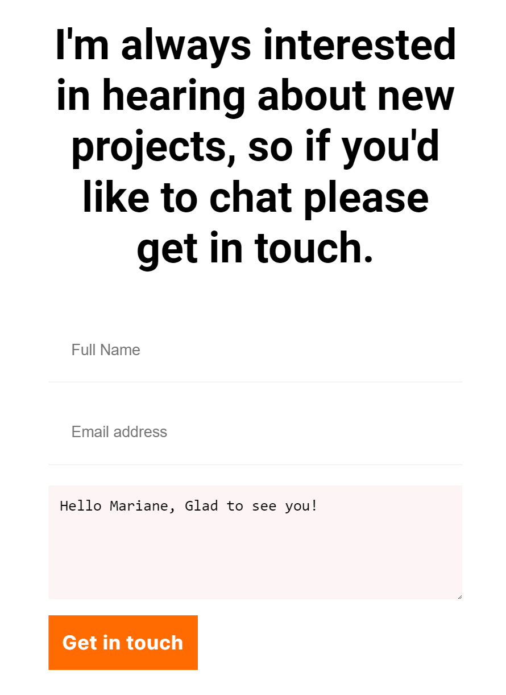

# icroverse curriculum-cr-training-contact-form

> Building the contact form section of this project after cloning the project from Microverse curriculum-cr-training-contact-form

## Built With

- Html
- Css
- JavaScript

### Prerequisites

- Text editor
- Git
- Github

## Getting Started

To get a local copy up and running follow these simple steps.

- You can clone this repo by typing `git clone https://github.com/julie-ify/Contact-Form.git` on your terminal
- Type `cd Contact-Form` to access the project on the terminal

## Author

👤 **Juliana Ifionu**

- [GitHub](https://github.com/julie-ify)
- [LinkedIn](https://www.linkedin.com/in/e-ifionu/)

## 🤝 Contributing

Contributions, issues, and feature requests are welcome!

Feel free to check the [issues page](https://github.com/julie-ify/Contact-Form/issues).

## Show your support

Give a ⭐️ if you like this project!

## Acknowledgments

- Microverse for providing this project for the purpose of code review training

## 📝 License